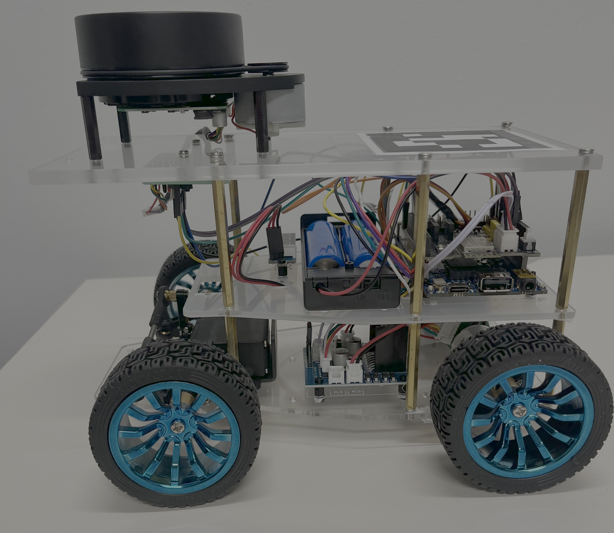

# NYU ROB-GY 6213: Robot Localization and Navigation

This repository contains the lab work for the NYU course `ROB-GY 6213`, organized as a progression from basic robot communication and data logging to state estimation with an Extended Kalman Filter (EKF) and a Particle Filter (PF).



Each lab keeps both:

- `robot_arduino_code/`: firmware for the robot side
- `robot_python_code/`: laptop-side control, visualization, logging, and analysis tools

The current state of the repository also includes additional offline analysis utilities, recorded `.pkl` trial logs, and generated plots for later experiments in Labs 3 and 4.

## Repository Layout

```text
.
|-- base_code_lab_01/
|-- base_code_lab_02/
|-- base_code_lab_03/
|-- base_code_lab_04/
|-- calibration_images_webcam/
|-- stationary_or_not.py
`-- README.md
```

## Lab Overview

### Lab 1: Robot I/O, Logging, and Basic GUI

`base_code_lab_01` introduces the hardware/software loop:

- UDP communication between the laptop and robot
- command sending and sensor message parsing
- data logging to `.pkl`
- NiceGUI-based monitoring UI
- optional ArUco camera pose estimation support

Key files:

- `base_code_lab_01/robot_python_code/robot_python_code.py`
- `base_code_lab_01/robot_python_code/robot_gui.py`
- `base_code_lab_01/robot_python_code/parameters.py`

### Lab 2: Motion Modeling and Calibration

`base_code_lab_02` builds on Lab 1 with motion-model work and data analysis utilities:

- encoder calibration
- steering-to-yaw calibration
- motion-model helper functions
- logged data post-processing

Key files:

- `base_code_lab_02/robot_python_code/calibrate_encoder.py`
- `base_code_lab_02/robot_python_code/calibrate_steering_to_yaw.py`
- `base_code_lab_02/robot_python_code/motion_models.py`
- `base_code_lab_02/robot_python_code/data_handling.py`

### Lab 3: EKF Localization

`base_code_lab_03` introduces map-based localization with an Extended Kalman Filter:

- online robot wrapper for EKF updates
- NiceGUI visualization with covariance ellipses
- offline EKF analysis scripts for replaying saved runs
- camera calibration and experiment result plots

Key files:

- `base_code_lab_03/robot_python_code/extended_kalman_filter.py`
- `base_code_lab_03/robot_python_code/robot.py`
- `base_code_lab_03/robot_python_code/robot_gui.py`
- `base_code_lab_03/robot_python_code/ekf_offline_analysis.py`
- `base_code_lab_03/robot_python_code/ekf_offline_analysis_2.py`

### Lab 4: Particle Filter Localization

`base_code_lab_04` extends the project to Particle Filter localization with lidar-based correction:

- particle state propagation from encoder and steering inputs
- lidar likelihood weighting against a wall map
- particle cloud visualization
- offline comparison between prediction-only and full PF updates
- additional experiment logs and plots for straight, curved, circular, and kidnapped-robot style trials

Key files:

- `base_code_lab_04/robot_python_code/particle_filter.py`
- `base_code_lab_04/robot_python_code/robot.py`
- `base_code_lab_04/robot_python_code/robot_gui.py`
- `base_code_lab_04/robot_python_code/pf_offline_analysis.py`
- `base_code_lab_04/robot_python_code/pf_offline_analysis_2.py`

## Additional Files

- `calibration_images_webcam/`: webcam images used for camera calibration workflows
- `stationary_or_not.py`: a small standalone Bayes filter example for stationary vs. moving object inference from image-space motion

## Software Stack

The Python code in this repository uses the following packages across the labs:

- `numpy`
- `matplotlib`
- `opencv-contrib-python` for ArUco marker detection
- `pyserial`
- `nicegui`
- `fastapi`

Standard library modules such as `socket`, `pickle`, `math`, `time`, and `pathlib` are also used heavily.

There is no pinned `requirements.txt` in the repository, so the environment is currently managed manually.

## Recommended Setup

From the repository root:

```powershell
py -3 -m venv .venv
.\.venv\Scripts\Activate.ps1
pip install numpy matplotlib opencv-contrib-python pyserial nicegui fastapi
```

If you only want to run offline analysis, you may not need active serial hardware. Some of the newer analysis utilities in Lab 4 are written to tolerate missing hardware-only dependencies when possible.

## Running the Labs

Most Python scripts assume you run them from the corresponding `robot_python_code` directory so local imports resolve correctly.

### Launch a GUI session

Example for Lab 4:

```powershell
cd base_code_lab_04\robot_python_code
py -3 robot_gui.py
```

Equivalent GUI entry points also exist for Labs 1 through 3:

- `base_code_lab_01/robot_python_code/robot_gui.py`
- `base_code_lab_02/robot_python_code/robot_gui.py`
- `base_code_lab_03/robot_python_code/robot_gui.py`
- `base_code_lab_04/robot_python_code/robot_gui.py`

### Run EKF offline analysis

```powershell
cd base_code_lab_03\robot_python_code
py -3 ekf_offline_analysis.py
```

### Run PF offline analysis

```powershell
cd base_code_lab_04\robot_python_code
py -3 pf_offline_analysis.py
```

## Configuration Notes

Each lab has its own `parameters.py`. Before running on hardware, check and update:

- laptop and robot IP addresses
- UDP ports
- camera intrinsics and distortion coefficients
- trial timing and logging paths
- map geometry
- estimator tuning values

For example, Lab 4 keeps PF-specific settings such as:

- number of particles
- lidar likelihood variance
- max lidar range handling
- encoder and steering conversion factors
- wall map definition

## Data and Plots

The repository includes saved experiment logs (`.pkl`) and generated figures, especially in:

- `base_code_lab_03/robot_python_code/data/`
- `base_code_lab_03/robot_python_code/data_given/`
- `base_code_lab_03/robot_python_code/data_straight_given/`
- `base_code_lab_03/robot_python_code/plots/`
- `base_code_lab_04/robot_python_code/data/`
- `base_code_lab_04/robot_python_code/plots/`

These datasets are useful for:

- replaying EKF and PF experiments offline
- comparing prediction-only vs. correction-enabled localization
- checking estimator drift and covariance behavior
- documenting experiment outcomes for reports

## Hardware Context

The codebase is built around a small mobile robot platform with:

- Arduino-side firmware
- UDP communication over Wi-Fi
- encoder and steering feedback
- lidar measurements
- webcam-based ArUco pose estimates on the laptop side

Because the project was developed as course lab code, some scripts are intentionally lab-specific and tuned to a particular robot, room layout, or experiment setup.

## Notes on the Current Repository State

At the time this README was written, the repository includes:

- EKF and PF lab implementations
- multiple recorded trial logs
- added PF offline analysis scripts
- experiment plot folders for several Lab 4 trajectories
- local parameter tuning updates for the current map and sensor setup

If you are continuing development, Lab 4 is the main place where the newest localization experiments and analysis utilities are concentrated.
